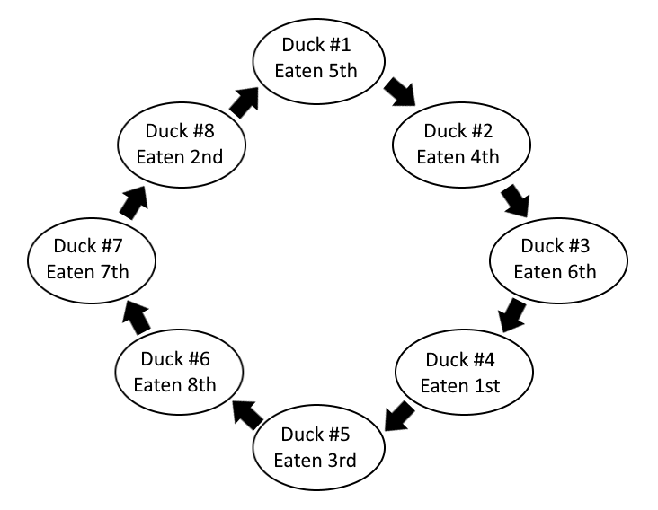

# Programming Problem #4 - Ducks
**Filename:** ducks.cpp, ducks.java, ducks.cs, or ducks.py

### Description
Suppose there are n ducks floating on a pond in a circle. The pond is also home to an alligator with a fondness for ducks. Beginning at a particular position (duck number 1), the alligator counts around the circle and eats every m-th duck (the circle closing as ducks are eaten). For example, when n = 8 and m = 4, the diagram shows the duck number and the consumption order.

*Provided diagram is a recreation of the one provided*

The first duck is the fifth duck on the menu, the second duck is the fourth, and so on. The sequence 5 4 6 1 3 8 7 2 completely describes the order of consumption.

Write a program which prints out the order of consumption given n and m.

### Input

The first line is the value of n. The second line is the value of m. m and n are both integers between 1 and 100 (inclusive).

### Output

Output the order of consumption on a single line with one space between each value. It is okay to have a space after the last number printed.

#### Test Case #1
**Sample Input:**
8
4

**Sample Output:**
5 4 6 1 3 8 7 2